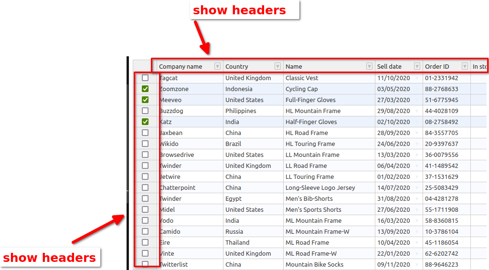

### refer:
官网：[handsontable](https://handsontable.com/docs)

初学者可以看这里：
guide [Developer guides](https://handsontable.com/docs/javascript-data-grid/https://handsontable.com/docs/javascript-data-grid/https://handsontable.com/docs/javascript-data-grid/https://handsontable.com/docs/javascript-data-grid/https://handsontable.com/docs/javascript-data-grid/https://handsontable.com/docs/javascript-data-grid/https://handsontable.com/docs/javascript-data-grid/https://handsontable.com/docs/javascript-data-grid/)
react-demo [react-demo](https://codesandbox.io/s/handsontable-react-data-grid-hello-world-app-13-0-0-965nm6)

重要的是这一章内容：
[Binding to data](https://handsontable.com/docs/javascript-data-grid/binding-to-data/)


### 创建项目

```
create-react-app test-handsontable_20230805
```
### 进入项目文件夹，启动server

```
cd test-handsontable_20230805
npm start
```


### 安装依赖，handsontable

```
npm install handsontable
```

直接引入：
```
import Handsontable from 'handsontable';

import 'handsontable/dist/handsontable.full.min.css';
```

或者使用cdn:
```
<script type="text/javascript" src="https://cdn.jsdelivr.net/npm/handsontable/dist/handsontable.full.min.js"></script>

<link rel="stylesheet" href="https://cdn.jsdelivr.net/npm/handsontable/dist/handsontable.full.min.css" />
```
测试使用：

创建一个container:
```
<div id="example"></div>
```

初始化
```
const container = document.querySelector('#example');
const hot = new Handsontable(container, {
  data: [
    ['', 'Tesla', 'Volvo', 'Toyota', 'Ford'],
    ['2019', 10, 11, 12, 13],
    ['2020', 20, 11, 14, 13],
    ['2021', 30, 15, 12, 13]
  ],
  rowHeaders: true,
  colHeaders: true,
  licenseKey: 'non-commercial-and-evaluation' // for non-commercial use only
});
```

这是一个demo
在线可以编辑的[React demo ](https://codesandbox.io/s/handsontable-react-data-grid-hello-world-app-13-0-0-forked-k4ypws?file=/src/index.tsx)
参数colHeaders，rowHeaders可以选择是否显示左侧和顶部的headers,
例如, 把两者都设置为false：
```
 colHeaders={false}
      /*
      colHeaders={[
        "Company name",
        "Country",
        "Name",
        "Sell date",
        "Order ID",
        "In stock",
        "Qty",
        "Progress",
        "Rating"
      ]}*/
      dropdownMenu={true}
      hiddenColumns={{
        indicators: true
      }}
      contextMenu={true}
      multiColumnSorting={true}
      filters={true}
      rowHeaders={false}
```
可以看到excel就在显示的时候只显示内容：


例如，把两者都显示，设置为true：
```
 <HotTable
      data={data}
      height={450}
      colWidths={[140, 126, 192, 100, 100, 90, 90, 110, 97]}
      colHeaders={[
        "Company name",
        "Country",
        "Name",
        "Sell date",
        "Order ID",
        "In stock",
        "Qty",
        "Progress",
        "Rating"
      ]}
      dropdownMenu={true}
      hiddenColumns={{
        indicators: true
      }}
      contextMenu={true}
      multiColumnSorting={true}
      filters={true}
      rowHeaders={true}
```
显示的内容就如图：

